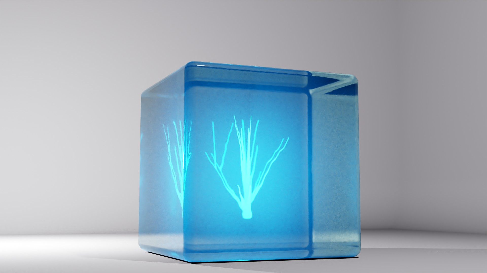

# Blender 2.83 Lightning Addon
A simple Blender add-on to summon lightning.
Anyone interested are wellcome to fork this repository.

# Download/Installation
* Download newest addon_add_lightning.py from https://github.com/paramphy/Lightning_add_onn/blob/master
* Under Edit > Preferences... > Add-ons > Install... open the downloaded *.py file
* Under Edit > Preferences... > Add-ons enable the "Add Mesh: Lightning Addon" script
* Add a spaceship in the 3D View under Add > Mesh > Lightning Addon
# Features

# Youtube Tutorial

 
